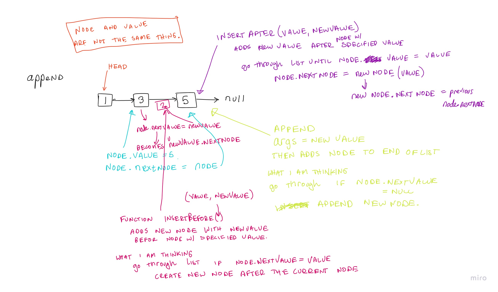

# Challenge Summary
Implement a First In First Out Animal Shelter

## Whiteboard Process
Code Challenge 11: 

## Approach & Efficiency
The big(O) runtime efficiency would be O(1) because it is a queue.
The big(O) space efficiency would also be O(1) because there is no more space being allocated within the algoritihm.

## Solution

### Enqueue
The approach I took was to use two different stacks. Stack 1 was the considered the shuffler and stack 2 was the container.
Every time a pet is enqueued into the shelter, the stack2 is inserted into stack 1 and then the new pet is added at the top of the stack.
Then the elements in stack1 are emptied back into stack2 to make sure that the top of stack 2 was the first element enqueued.

### Dequeue
The approach for dequeue was a little more complex because we had to filter if the String argument specified a certain cat or dog.
The algorithm would check to see if the top of the stack 2 was equal to the preferred type, if it is it would return that animal object.
If not, then the element would be added into stack 1 and check the next element in stack2. Once an element with the preffered type was found,
it would pop() that element off the stack2, and then read all the elements placed in stack1 back into stack 2, this maintaining FIFO.

- Test `testAnimalShelterEnqueue` tests to enqueue an animal object.
- Test `testAnimalShelterDequeueFirstCat` tests to dequeue the first "cat" placed into the shelter.
- Test `testAnimalShelterDequeueFirstDog` tests to dequeue the first "dog" placed into the shelter.
- Test `testAnimalShelterDequeueMultipleDogs` tests to dequeue multiple dogs placed into the shelter.
- Test `testAnimalShelterDequeueReturnNull` tests if a value is null is returned if a preferred type is not specified as "cat" or "dog".

