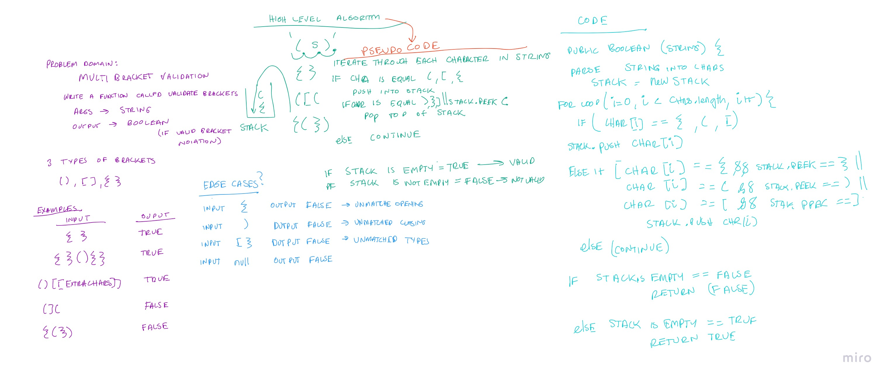

# Challenge Summary
Write a function the validates a string.

## Whiteboard Process
Code Challenge 11: 

## Approach & Efficiency
The big(O) runtime efficiency would be O(n) because it scales linearly with the input.
The big(O) space efficiency would also be O(n) because in the worst case scenario, the character of the input would be placed into the stack.

## Solution

The approach I took was to implement a stack. The stack was used to hold opening parentheses. Through iteration, each of the 
characters in the string was checked for the following cases outlined in the whiteboard. After iterating through the entire string,
if the stack is empty, return true. 

- Test `testValidString` to test a valid string of parenthesis.
- Test `testValidStringTwo` tests another valid string of parentheses with other characters in between.
- Test `testNotValidString` tests an invalid string returns false.
- Test `testSingleString` tests an invalid input of one open parenthesis.