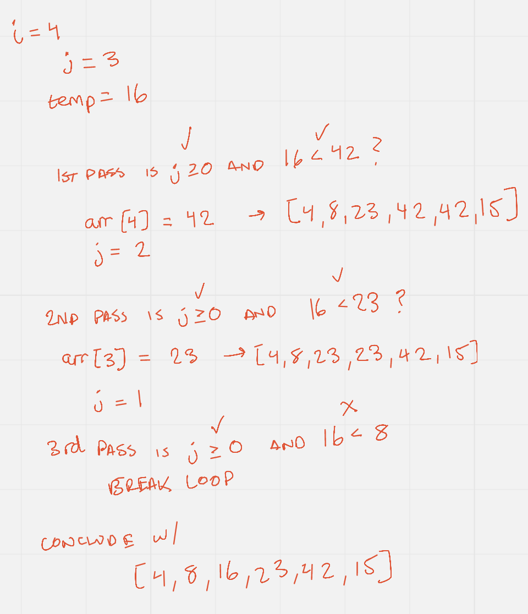

# Insertion Sort Blog Post

Insertion sort is a algorithm which gradually builds up the sort from the left
which is always sorted. 

## Process

Example input - `[8,4,23,42,16,15]`

### Pass 1 

Starting at i = 1, we declare our new values of j and temp. We enter the while loop and ask the two questions for it to remain true.
Is J greater than or equal to zero and the value of temp (4) less than the value at index j (8)? Yes, so we modify the value
at index 0. Next we enter our while loop again and ask the same two questions. Is the j greater than or equal to 0? No, so we leave our while loop.
Then the last line of code tells us to set the value at index j to the temp value of 4.

### Pass 2

Moving on to i = 2, we perform the same steps of setting our new values for j = 1 and temp = 23. 
We than move onto the while loop and ask the same two questions, but this time we get an answer of `no` right off the bat.
We find that 23 is not less than 8. So we leave our while loop without making any modifications to the array. We conclude this pass by setting
the value at `arr[j+1]` to the same value it is currently. 

### Pass 3

The remaining passes all perform the same operations with different values of j and temp. The same two questions for the while loop
to remain true are asked. 

### Pass 4

Note this pass requires us to take three iterations through our while loop before exiting.

### Pass 5
Our last pass requires us to take four iterations of the while loop before exiting. We leave this last iteration with our now sorted array of 
`[4,8,15,16,23,42]`

### Conclusion

After our last iteration we now have a completely sorted array in ascending order. The big O space complexity is o(1) since we are 
not allocating any additional memory in storage, we are simply modifying the array in place. The big O runtime efficiency worst case scenario is o(n2).
This is because we have to iterate over each value in the array by potentially the length of the array in the worst case. This is quite a bad solution then if
the worst case scenario takes place. Insertion sorts can be very useful in some situations though, for example when an array is almost fully sorted which may occur 
in a live-streaming user event. 

## Tests

- `testInsertionSortArrayOne` - Tests the array for the given example input writtent about above.
- `testInsertionSortReverseSorted` - Tests the array which is sorted in reverse.
- `testInsertionSortFewUniqueValues` - Tests an array with few unique values.
- `testInsertionSortAlmostSorted` - Tests an array which is nearly sorted.