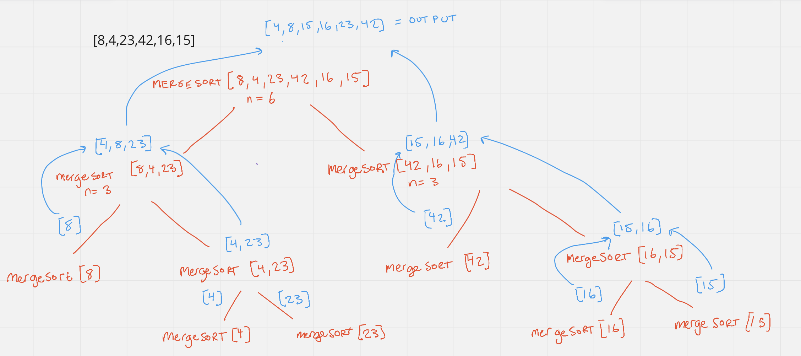
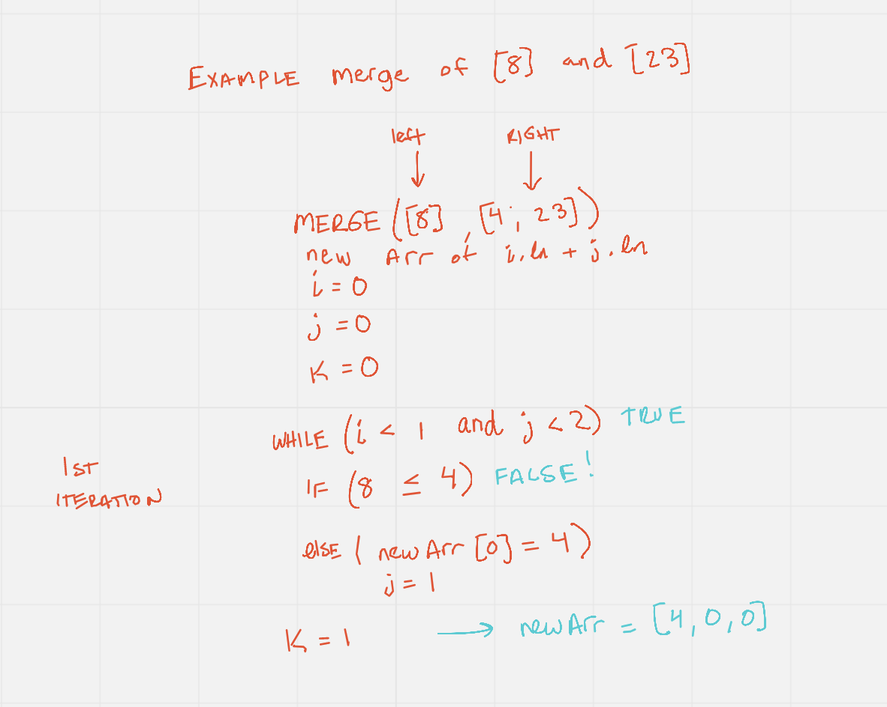
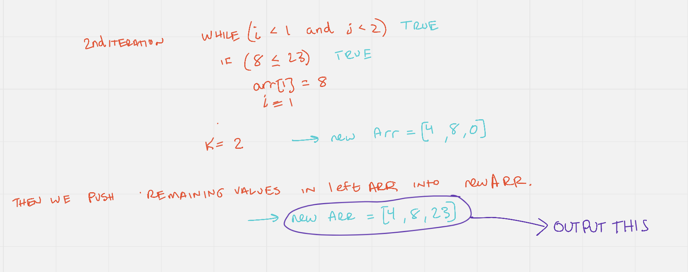
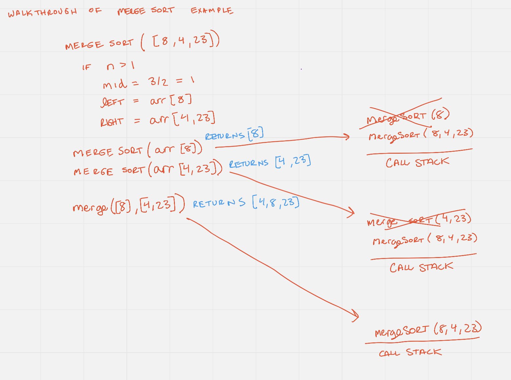

# Merge Sort Blog Post

- Combination of two things, merging and sorting.
- Exploits the fact that arrays of 0 and 1 element are always sorted and merging sorted arrays is relatively easy.
- Works by decomposing an array into smaller arrays of 0 or 1 elements, then builds up a newly sorted array.

## Overall Algorithm

### First Task: How do you merge two sorted arrays?
- create an empty array, take a look at the smallest values in each input array.
- While there are still values we haven't looked at...
- If the value in the first array is smaller than the value in the second array than we push this value into the new array
If it is greater than we add the value in the second array. 
- Once we exhaust one array, push in all remaining values from the other array.

### Second Task: How do we break down the input array into single elements?
- implement a recursive function to break down the input array into single arrays.
- then merge each element back to completely sorted array to output.

## Process

Example input of `[8,4,23,42,16,15]`.

### Part 1: Broad Overview of the entire algorithm

I think it helps to take a look at the big picture of what is actually going on with the combination of merging and sorting.
We can see that it looks like a tree structure right of the bat. First we break down the input array into smaller and smaller arrays, until we have arrays with single
elements, depicted as the leafs in the visual (If your familiar with tree data structures). This is accomplished using recursion and repetedly calling `mergeSort` on the decomposing arrays.
Once we have the single elements, we use the helper function of `merge` to build back up the sorted arrays until we finally get the input array in ascending sorted order as a result.
Below are walk-throughs of `mergeSort` and `merge`. 

### Part 2: `merge` Breakdown

#### First Iteration

With the given example above, we have input arrays of `[8]` and `[4,23]`. We then declare three different array counters. Then while each corresponding counter, 
is less than its array length, we compare each value at the counter index and add the smaller value to the output array.
#### Second Iteration

The second iteration is the same as the first, but this time we are out of values in our first array.
Since the input arrays are of different size, one will empty faster than the other. So after the first while loop is complete, 
we then have to add all the rest of the values of the other array into the output array.

### Part 2: `mergeSort` Breakdown

Here is a quick breakdown of an example input to `mergeSort`. Our base case for the recursive call to stop, is when n <= 1, then we will 
return the array with a single element. If this is not the case, we will have to continue to find the midpoint of the input array and split it into two halves. 
Then we call mergeSort on the left half, then on the right half. Note we have to wait until the call stack clears until we can finally merge the resulting arrays.

### Conclusion

The big O of merge sort for space complexity is O(n) because as n grows we have allocated that much more space to memory (from each of the arrays we have to split and merge). The big O runtime complexity is O(n log b),
because we have to split(decompose) the input array O(log n) times. For example with an array of 32 inputs, we have to split the array 5 times (2^5), and then n comparisions to merge the arrays back together.
This results in O(log n) * O (n) which is equal to O (n log n).

## Tests

- WIP

## Notes

- Merge sort is one of the faster sorting algorithms. It decreases o(n2) to o(log(n))

## Resources

- [Data Structures Course](https://www.udemy.com/course/js-algorithms-and-data-structures-masterclass/learn/lecture/11072020#learning-tools)
