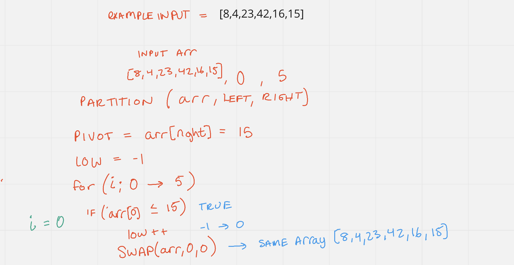
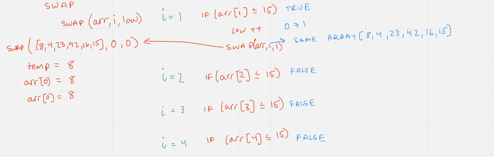
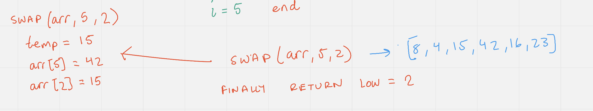
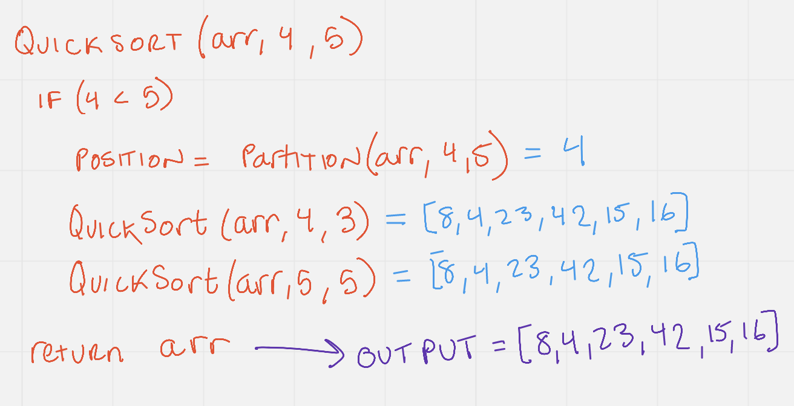

# Quick Sort Blog Post

- Like merge sort, exploits the fact that arrays of 0 or 1 element are always sorted.

## Overall Algorithm

### Pivot Helper

- A helper function that designates an element as the pivot. Should do it in place, not make a new array.
- Picking a pivot, the runtime of quick sort depends in part on how one selects the pivot. For this case we will pick the first element
as the pivot for simplicity.
- The pivot rearranges the array and makes sure that every element less than the pivot is on the left side, but it does not make sure all the elements on the left side
are in the correct spot. Only the pivot is in the correct spot for-sure. 

### Quicksort

- Call the pivot helper on the array.
- When the helper returns the updated pivot index, we recursively call the pivot helper on the left and right sub-arrays of that index.
- The base case is anything with less than two elements. If left and right are equal.
- The function should accept three arguments; the array, sub-array of left side, and sub-array of right side.

### Swap Helper

- Swap will be used to switch the corresponding elements with each other.

## Process

Example input of `[8,4,23,42,16,15]`.

### Part 1: Partition Run through

First we will walk through the partition helper function. As you can see we start with our input array, and a left and right index marker. 
Then we choose the pivot in which we will finding the correct corresponding location for, by the end of the function. In this case it is 15. We declare
a counter of low to track were the pivot needs to be placed. Then we begin our for loop in which we step through each element of the array and compare it to the 
pivot. If the value at the array index is less than the pivot value of 15, we increment our low index, and swap the index and the low index with each other.

Then we move through the array for each index within the set bounds, asking the same question. At an index of i = 1, we find that the value is less than the pivot value,
so we increment low, and swap the i index array value and the low index array value (in this case the same). For the other index values in the for loop, nothing happens.

We conclude the partition by swapping the pivot index with the low index of 1 + 1 = 2. All values below this index are less than the pivot value, but not necessarily sorted.
The pivot value though is in its final correct place though. We return the Low index of low + 1 = 2, so it can be used in the other recursive calls. 

### Part 2: Quicksort Run through

Here is an example run through of our quickSort function with the input array and a left and right bounds of 4 and 5. The base condition for this recursive function is the left index must be
less than the right index. First we have to define the position of the pivot value. This is done using our partition helper function described above. We then use this
pivot position index to call quicksort on the left and right side of the pivot location. The left side and then the right side of the function being called in order. For each of these recursive function calls, the
left and right index boundaries will get smaller and smaller after correctly positioning its pivot values, until the call stack ends with the first function call. At the end we return the sorted array.

### Conclusion

The Big O of quicksort has the following time and space complexities. In the worst case scenario for time complexity we get a big O of (n2), if the array is almost entirely sorted. 
The best case scenario would be O (n log(n)). The space complexity would be o(log n). 

## Tests

-`testPartitionHelperFunction` - Verifies the partition helper function is returning the correct value.
-`testPartitionHelperFunctionArrayTwo`
-`testQuickSortFunction` - Tests the quicksort function on the example input array.
-`testQuickSortFunctionReversedArrayInput` - Tests the quicksort function on the example input array in reverse order.
-`testQuickSortFunctionReversedFewUniqueValues` - Tests the quicksort function on the example input array with few unique values.
-`testQuickSortFunctionReversedNearlySorted` - Tests the quicksort function on the example input array on a nearly sorted array.
-`testQuickSortFunctionReversedSmallSize` - Tests the quicksort function on the example input array with a small size.
-`testQuickSortFunctionReversedBigSize` - Tests the quicksort function on the example input array with a big size.

## Resources

- [Data Structures Course](https://www.udemy.com/course/js-algorithms-and-data-structures-masterclass/learn/lecture/11072020#learning-tools)
