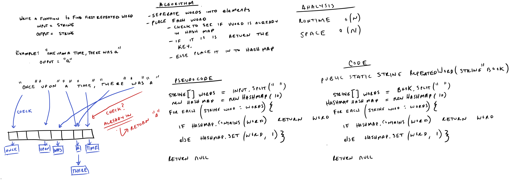

# Challenge Summary
Write a function called repeated word that finds the first word to occur more than once in a string.

`Arguments`: String

`Return`: String 

## Whiteboard Process

## Approach and Efficiency

The approach included using the previous constructed hashmap data-structure. The string was first separated into individual
elements using `split()`. The string was also modified to account for periods, commas, and uppercase letters using `replace()`.

Each element in the array was the checked to see if a previous key of the string was already located in the hashmap. If it was not, than then 
key was added to the hashmap, if it was already present, the key was returned.

The runtime big O is worst case o(n) since each word has to be checked in the array of strings. This scales with the size of n. 
The space big O is o(n), with a new array being created which scales with the size of the input string. 

## Solution

### Vanilla
- `testRepeatedWordsShortString`
- `testRepeatedWordsMediumString`
- `testRepeatedWordsLongString`
- `testRepeatedWordsLongestString`
- `testRepeatedWordsEmpty`

### Stretch

- `testRepeatedWordsCounter`
- `testRepeatedWordsCounterSameString`

