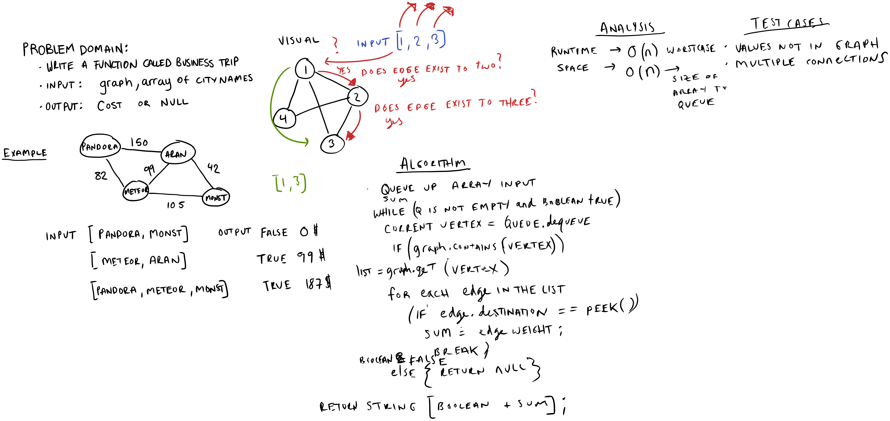

# Challenge Summary

Given a business trip itinerary, and an Alaska Airlines route 
map, is the trip possible with direct flights? If so, how much will the total trip cost be?

`Arguments`: Graph, String[] of target cities.

`Return`: A boolean value along side the cost of the trip if applicable.

## Whiteboard Process

## Approach and Efficiency

The approach I took was to first iterate through the input string array and check to see each of the string values corresponded to 
a vertex in the graph, then if it did, it would be enqueued into a queue. 

Then a within a while loop, while the queue was not empty, the first node in the queue was checked to see if it had a neigbor corresponding to the vertex in the queue(using q.peek()). If this was true, we added the sum to a global
sum bucket and continued the next iteration of the while loop with the next vertex in the front of the queue. If a value corresponding to the next vertex in the queue was never found, the loop was also broken and
a value of false was returned. 

The runtime efficiency of the algorithm is O(n) corresponding with the size of the graph. 

The space efficiency of o(m) corresponding to the size of the input String array. 

## Solution

- `testGraphBusinessTripTravelBetweenTwoPoints`
- `testGraphBusinessTripTravelBetweenThreePoints`
- `testGraphBusinessTripNonExistingPaths`
- `testGraphBusinessTripRoundTrip`
- `testGraphBusinessTripFirstTripExistsSecondDoesNot`
- `testGraphBusinessTripFirstTripRepeatedValues`
- `testGraphBusinessTripCCDocumentationSampleOne`
- `testGraphBusinessTripCCDocumentationSampleTwo`
- `testGraphBusinessTripCCDocumentationSampleThree`
- `testGraphBusinessTripCCDocumentationSampleFour`

