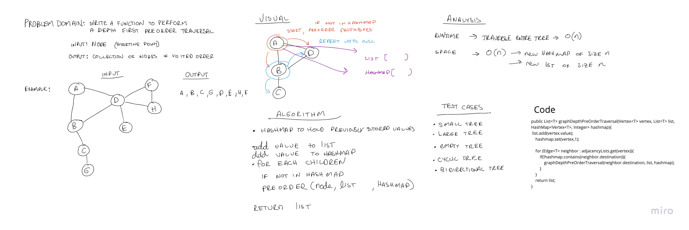

# Challenge Summary

Implement a depth-first preorder traversal on a graph.

`Arguments`: Node (vertex), List to hold values, Hashmap to hold values

`Return`: A collection of nodes in preorder traversal order.

## Whiteboard Process

## Approach and Efficiency

`NOTE: the function was added as a method inside the graph class.`

The approach I took was to recursively traverse the graph in preorder order. This was accomplished by first adding the root node to the list and to the hashmap to check for duplicate 
visits. Then each of the nodes neighbors were checked to see if they were present in the hashmap, if not the function was called with the neighbor as its starting point. Once the call stack cleared, 
the list with each of the nodes values was returned in the order they were visited. 

The big O runtime efficiency is O(n). The runtime grows in proportion to the size of the graph. Every node has to be visited.
The big O space efficiency is approximately O(n), since a new arraylist of values must be generated in proportion to the size of the graph, same goes for the hashmap. To be more precise the additional storage is o(3n).

## Solution

- `testGraphDepthTraversalShortestGraph`
- `testGraphDepthTraversalMediumGraph`
- `testGraphDepthTraversalMediumGraphMultipleEdges`
- `testGraphDepthTraversalLongGraphMultipleEdges`
- `testGraphDepthTraversalLongGraphMultipleEdgesDifferentStartingPoint`
- `testGraphDepthTraversalSingleVertex`
