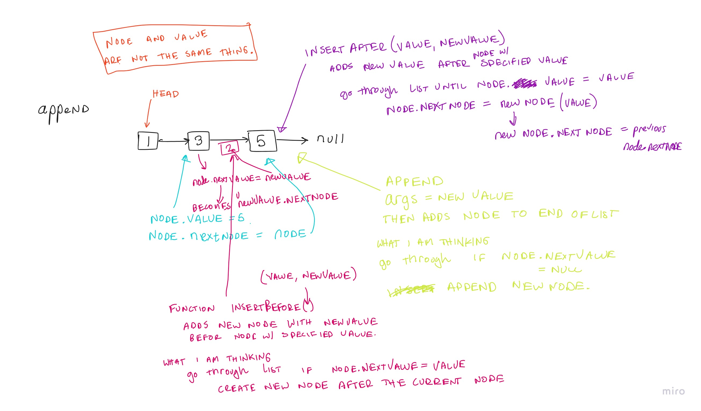

# Singly Linked List

## Challenge
Build out each of the following methods to traverse and manipulate a single linked list.

## Approach & Efficiency

### Conceptual Diagrams / Whiteboards
Code Challenge 06: 
Code Challenge 07: 

### Analysis of Each Method
The methods available are;
- insert
- size
- include
- append
- insertBefore
- insertAfter
- kthFromTheEnd
- zip
- reverse

### Insert
- The big(O) space would be O(1) because you are only adding a new object in a known location (at the beginning of the list). 
- The big(O) time would be O(1). 
### Includes
- The big(O) space would be O(n) because you have to search list until you find node with correct value.
- The big(O) time would be O(n) because it would take however long until the correct value is found in the list.

### Append
- Append allows you to add a new node to the end of the linked list. It takes in one argument Value, which is the value to be added.
- The big(O) space would be O(n) because you have to travers the entire list to find the last node.
- The big(O) time would be O(n) because you have to travers the entire list to find the last node.

### Insert Before
- InsertBefore allows you to add a new node with the given new value immediately after the first node that haas the specified value.
- The big(O) space would be O(n) because you have to search list until you find node with correct value.
- The big(O) time would be O(n) because it would take however long until the correct value is found in the list.

### Insert After
- InsertAfter allows you to add a given new value immediately after the first node that has the value specified.
- The big(O) space would be O(n) because you have to search list until you find node with correct value.
- The big(O) time would be O(n) because it would take however long until the correct value is found in the list.

### Kth From The End
- Kth From The End allows you to search the list for a given K value and returns the index of the value from the end of the list.
- The big(O) space would be O(2n) because you have to first calculate the size of the list, then run through it again to find the K value.
- The big(O) time would be O(1) constant time because in the worst case scenario you would have to traverse the entire list twice. 

### Zip
- Zip accepts two linked lists as arguments and "zips" the lists together and returns a new linked list with alternating values of the two lists.
- The space complexity is additional space complexity is O(n) because we have to reverse each input list. Then once we declare a new linked list. 
We will run through each list again and use the insert method (O(1)) to add the nodes to the linked list.
- What approach would allow you to keep and O(1)?

## References and Citations
- Referenced Ben Mills approach for a solid base.
- Referenced [Video on Linked List](https://www.youtube.com/watch?v=SMIq13-FZSE&ab_channel=Telusko)
