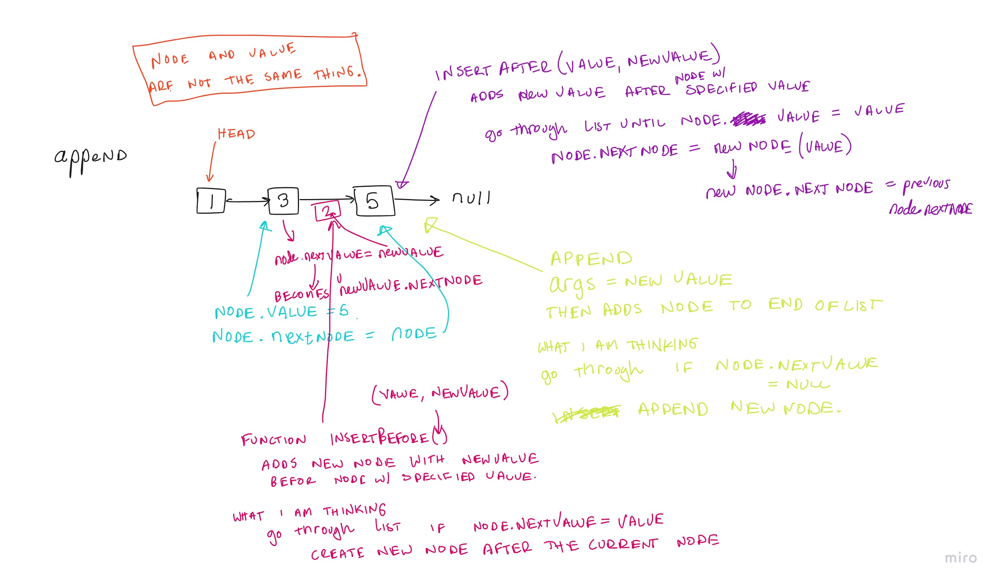

# Singly Linked List

## Challenge
Create a Node class that has the properties for the value stored in the Node, and the pointer to the next node.

## Approach & Efficiency

### Conceptual Diagrams / Whiteboards
Code Challenge 06: 

### Analysis of Each Method
The methods available are insert, include, append, insertBefore, and insertAfter.

### Insert
- The big(O) space would be O(1) because you are only adding a new object in a known location (at the beginning of the list). 
- The big(O) time would be O(1). 
### Includes
- The big(O) space would be O(n) because you have to search list until you find node with correct value.
- The big(O) time would be O(n) because it would take however long until the correct value is found in the list.

### Append
- Append allows you to add a new node to the end of the linked list. It takes in one argument Value, which is the value to be added.
- The big(O) space would be O(n) because you have to travers the entire list to find the last node.
- The big(O) time would be O(n) because you have to travers the entire list to find the last node.

### Insert Before
- InsertBefore allows you to add a new node with the given new value immediately after the first node that haas the specified value.
- The big(O) space would be O(n) because you have to search list until you find node with correct value.
- The big(O) time would be O(n) because it would take however long until the correct value is found in the list.

### Insert After
- InsertAfter allows you to add a given new value immediately after the first node that has the value specified.
- The big(O) space would be O(n) because you have to search list until you find node with correct value.
- The big(O) time would be O(n) because it would take however long until the correct value is found in the list.

## References and Citations
- Referenced Ben Mills approach for a solid base.
- Referenced [Video on Linked List](https://www.youtube.com/watch?v=SMIq13-FZSE&ab_channel=Telusko)
