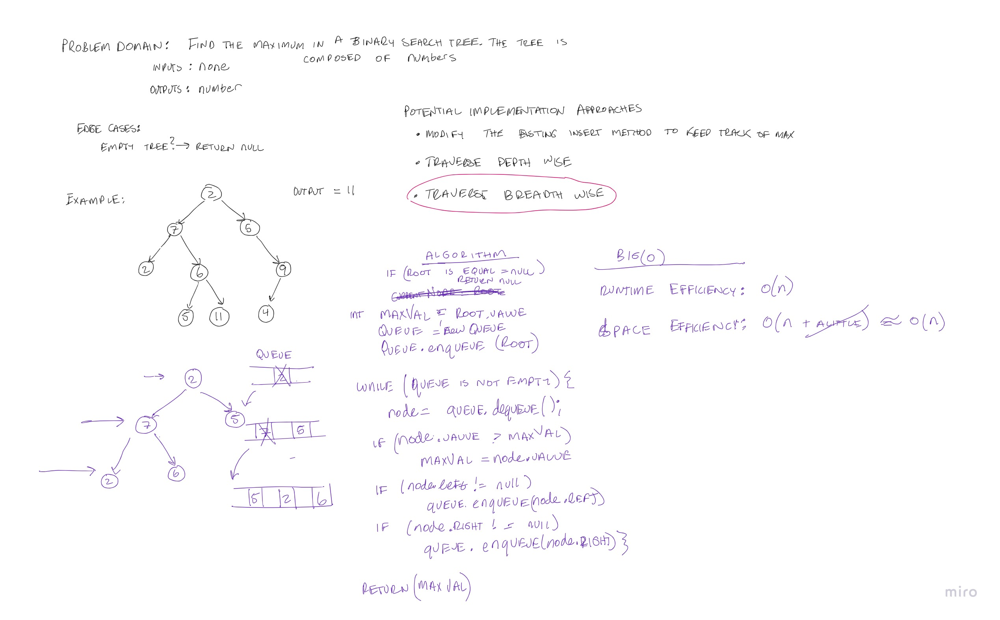

# Trees

Implement a Binary and Binary Search Tree Classes with the following methods.
- Non Linear Data Structure
- Binary trees can have values of any type, but at most two children for each parent.
- BFS and DFS traversal. DFS - inOrder, PostOrder, PreOrder. 

## Challenge

### Create a Node class 

Has properties for the value stored in the node, the left child node, and the right child node.

### Create a Binary Tree class

Define a method for each of the depth first traversals:
- `pre order`
- `in order`
- `post order` 

### Create a Binary Search Tree Class
This class should be a sub-class (or your languages equivalent) of the Binary Tree Class, with the following additional methods:
- `Add`, Arguments: value, Return: nothing, Adds a new node with that value in the correct location in the binary search tree.
- `Contains`, Argument: value, Returns: boolean indicating whether or not the value is in the tree at least once.

### Create a method to find the maximum value in a Binary Tree

- `findMax`, Arguments: none, Returns: number.

Code Challenge 16 Whiteboard: 
## API

### Binary Tree

#### pre orderTraversal

- O(n) as the size of the tree grows, so does the run complexity. It has to visit every node one time.
- O(n) space could be larger if the depth of the tree is very high, reverse if width of tree is greater, causing extra space to be store in queue.
- `testPreOrderTraversal`

#### in orderTraversal

- O(n)
- If you apply inOrder on a BST, you will receive all the values in order. 
- `testInOrderTraversal`

#### post orderTraversal

- O(n)
- `testPostOrderTraversal`

#### findMax

- Approach is outlined in the following whiteboard. There were several ways I though about this algorithm. I decidec to traverse the tree
using a breadth first approach. Breadth first approach uses a queue to keep track of where you are in the tree traversal. 
- The space efficiency is approximately O(n) with a little additional memory being allocated with in the queue data structure.
- The runtime efficiency is also O(n) because the entire tree has to be traversed inorder to find the maximum value.
- `testBinaryTreeFindMaximumValueUsingBreadth` to test a maximum value in a stack is correct.
- `testBinaryTreeFindMaximumValEmptyTree` to test if an exception is thrown for empty tree.

### Binary Search Tree

#### Add (Insertion)
 - Inserts a value into the BST.
 - O(log n), as the size of the tree grows it can only increase by a certain amount. This is the best case. 
 - `testInsertBst`

#### Contains (Searching)
- Evaluates whether a certain value is found within the BST.
- O(log n), as the size of the tree grows it can only increase by a certain amount, with a relationship of log n. 
- `testContainsBst`
- `testNegativeContainsBst`

