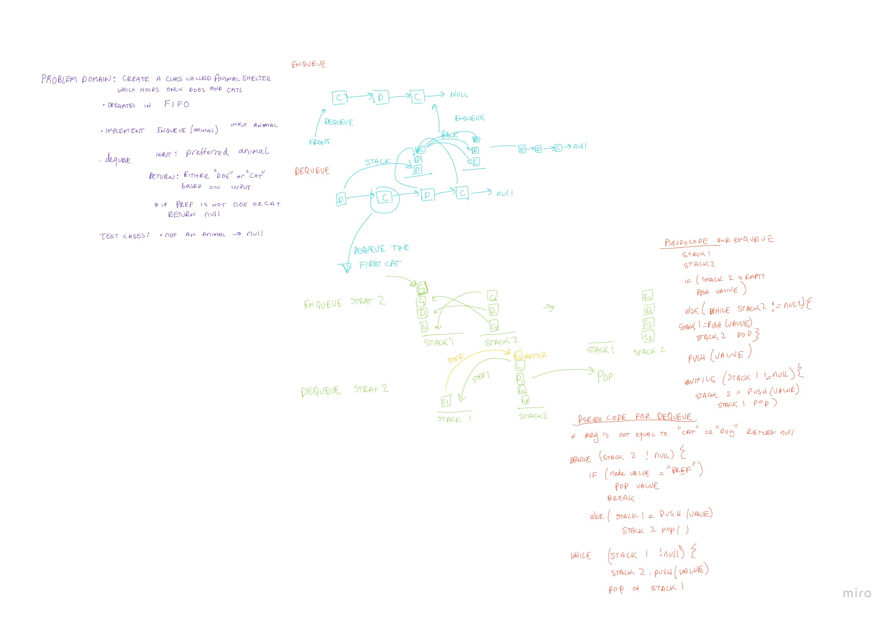

# Challenge Summary
Implement a First In First Out Animal Shelter

## Whiteboard Process
Code Challenge 11: 

## Approach & Efficiency
The big(O) runtime efficiency would be O(1) because it is a queue.
The big(O) space efficiency would also be O(1) because there is no more space being allocated within the algoritihm.

## Solution

WIP.