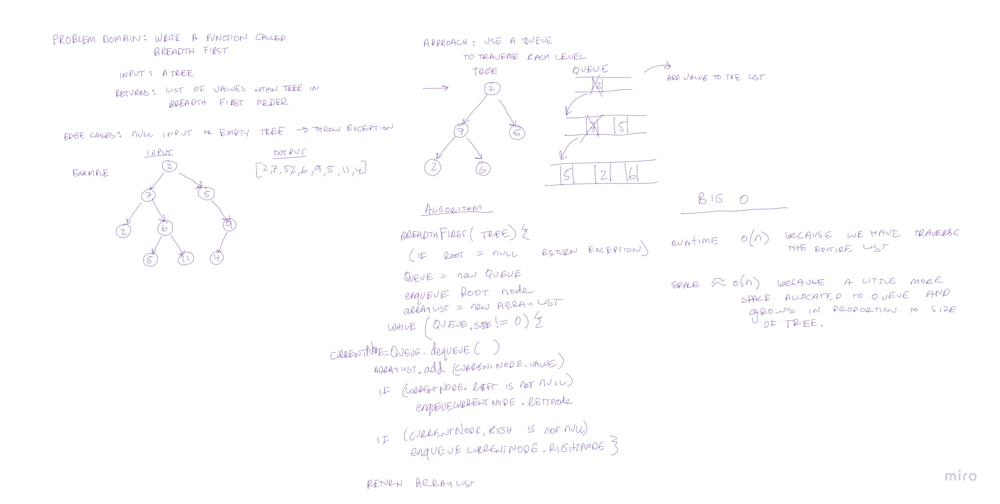

# Challenge Summary
Write a function called breadth first.

`Arguments`: tree

`Return`: list of all values in the tree, in the order they were encountered

## Whiteboard Process
Code Challenge 17: 

## Approach & Efficiency
The big(O) runtime efficiency would be O(n) because we have to traverse through the entire tree.
The big(O) space efficiency would also be approximately O(n) because allocated storage increases with the size of the tree. 

## Solution

The approach I took was to use a queue. At the beginning the root of the tree is pushed into the queue. Then within the following
while loop the front of the queue is dequeued and the value of that node is stored in the arraylist. Then check to see if the node has any 
left or right node children. If so, they are added into the queue. Then when there is nothing left in the queue, we return the array list with 
all the values.

- Test `testBinaryTreeBreadthFirstTraverse` to test if a tree returns a list of values in a breadth first traverse order.
- Test `testBinaryTreeBreadthFirstTraverseSingleNode` to test if a single node tree returns a value in breadth first traverse order.
- Test `testBreadthFirstTraverseEmptyTree` to test if an empty tree throws an exception.