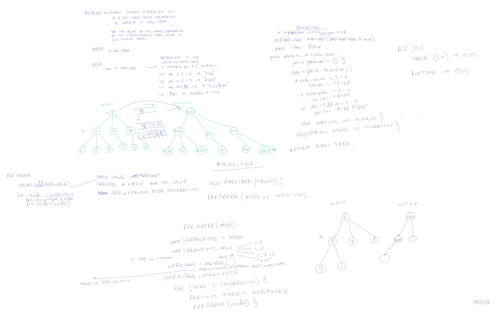

# Challenge Summary
Write a function called fizzbuzz.

`Arguments`: kary tree of integers

`Return`: new kary tree of strings

## Whiteboard Process
Code Challenge 18: 

## Approach and Efficiency 

I used a preorder traversal to navigate the input tree and map the corresponding nodes of the output string tree. The main issue 
I was running into was keeping track of the parent node when recursing through the tree output String tree. This was solved by keeping an instance
variable of currentStrNode to keep track of the parent node in the string tree and give access to adding the required children to it. 

The runtime big O is o(n) which scales with the size of the input tree. 
The additional space big O is (n) because we are creating a duplicate tree with the same size of the input tree. 

## Solution

The following tests are included in datastructures.karyTree.TestFizzBuzz and TestKaryTree

- Test `testKaryTreeFizzBuzz` = Tests an input tree and asserts if the correct tree of strings is output.
- Test `testKaryTreeOneValue` = Tests a tree with one node and asserts if the correct tree of strings is output.
- Test `testKaryTreeEmptyTree` = Tests an empty tree and asserts if a value of null is output. 
- Test `testKaryTreePreOrderIntegers` = Tests if the correct preOrderTraversal is returned for a kary tree of integers.
- Test `testKaryTreePreOrderStrings` = Tests if the correct preOrderTraversal is returned for a kary tree of strings.

